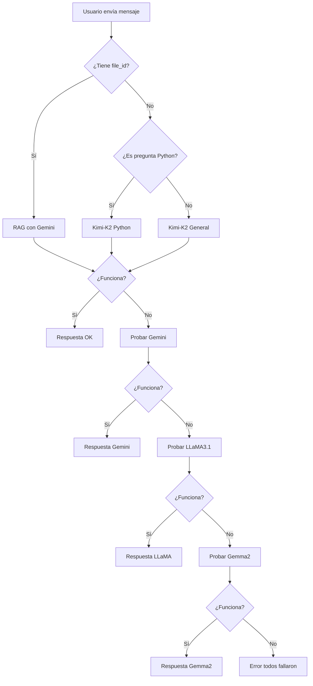

# 🚀 **SISTEMA HÍBRIDO MEJORADO - Integración con Modelos Locales**

## 📋 **Resumen de Mejoras**

Se ha implementado un **sistema híbrido mejorado** que integra los modelos locales (LLaMA3.1:8b, Gemma2:2b) con los modelos en la nube (Kimi-K2, Gemini 2.5 Flash), creando un sistema robusto con **fallback cascade inteligente**.

---

## 🎯 **Características Nuevas**

### **1. Routing Inteligente**
El sistema ahora decide automáticamente qué modelo usar basado en:

| Tipo de Pregunta | Modelo Principal | Razón |
|------------------|------------------|-------|
| **RAG con PDFs** | Gemini 2.5 Flash | Mejor para contexto largo |
| **Código Python** | Kimi-K2 | Especializado en Python |
| **Chat General** | Kimi-K2 | Más rápido y actualizado |

### **2. Fallback Cascade Completa**
```
1. Kimi-K2 (principal) 
   ↓ (si falla)
2. Gemini 2.5 Flash (nube)
   ↓ (si falla)  
3. LLaMA3.1:8b (local)
   ↓ (si falla)
4. Gemma2:2b (local - último recurso)
   ↓ (si falla)
5. Error informativo
```

### **3. Nuevos Endpoints**

#### **`GET /api/v1/hibrido/status`**
Retorna el estado completo del sistema híbrido:
```json
{
  "models": {
    "kimi_k2": {"available": true, "type": "cloud"},
    "gemini": {"available": true, "type": "cloud"},
    "llama3_1_8b": {"available": true, "type": "local"},
    "gemma2_2b": {"available": true, "type": "local"}
  },
  "routing_enabled": true,
  "total_models_available": 4,
  "system_health": "healthy"
}
```

#### **`GET /api/v1/hibrido/test`**
Ejecuta una prueba rápida del sistema híbrido.

#### **`GET /api/v1/hibrido/models`**
Retorna modelos disponibles con capacidades y especialidades.

---

## 🏗️ **Arquitectura Mejorada**

### **Componentes Nuevos**

1. **`LocalLLMClient`** (`src/adapters/agents/local_llm_client.py`)
   - Cliente para modelos Ollama locales
   - Health check automático
   - Soporte para LLaMA3.1:8b y Gemma2:2b

2. **`ChatServiceHibridoMejorado`** (`src/application/services/chat_service_hibrido_mejorado.py`)
   - Extiende el servicio original
   - Routing inteligente basado en tipo de pregunta
   - Fallback cascade con 4 niveles
   - Métricas mejoradas

3. **`HibridoStatus`** (`src/adapters/api/endpoints/hibrido_status.py`)
   - Endpoints para monitoreo del sistema híbrido
   - Dashboard de disponibilidad de modelos

### **Flujo de Decisión**



---

## ⚙️ **Configuración**

### **Variables de Entorno (Nuevas)**
```bash
# Habilitar modelos locales (default: true)
ENABLE_LOCAL_FALLBACK=true

# Configuración Ollama (default: http://localhost:11434)
OLLAMA_BASE_URL=http://localhost:11434

# Modelos locales disponibles
OLLAMA_LLAMA_MODEL=llama3.1:8b
OLLAMA_GEMMA_MODEL=gemma2:2b
```

### **Dependencias**
```bash
# Cliente HTTP para Ollama
httpx>=0.25.0
```

---

## 🚀 **Uso**

### **1. Iniciar Ollama (si no está corriendo)**
```bash
cd /ruta/a/tu/proyecto/docker
docker-compose up -d
```

### **2. Verificar Modelos Locales**
```bash
curl http://localhost:11434/api/tags
```

### **3. Probar Sistema Híbrido**
```bash
# Verificar estado
curl http://localhost:8000/api/v1/hibrido/status

# Probar funcionamiento
curl http://localhost:8000/api/v1/hibrido/test

# Ver modelos disponibles
curl http://localhost:8000/api/v1/hibrido/models
```

### **4. Usar en el Frontend**
```javascript
// El routing es automático, solo envía el mensaje como siempre
const response = await fetch('/api/v1/chat', {
  method: 'POST',
  headers: {'Content-Type': 'application/json'},
  body: JSON.stringify({
    session_id: "123",
    message: "¿Cómo funciona una lista en Python?",
    mode: "architect",
    file_id: null  // Para RAG, poner el ID del PDF
  })
});
```

---

## 📊 **Métricas Mejoradas**

El sistema ahora registra:
- **Modelo utilizado** (kimi-k2, gemini, llama3.1-8b, gemma2-2b)
- **Estrategia de routing** (rag_gemini, chat_kimi, code_kimi)
- **Nivel de fallback** (principal, fallback_1, fallback_2)
- **Tiempo de respuesta por modelo**
- **Disponibilidad en tiempo real**

---

## 🛠️ **Instalación**

### **1. Actualizar Dependencias**
```bash
cd agente_hibrido_texto_Kimi_rag_Gemini
uv sync
```

### **2. Configurar .env**
```bash
cp .env.example .env
# Editar .env con tus API keys
```

### **3. Iniciar Sistema**
```bash
# Backend con mejoras híbridas
docker compose up -d --build

# Acceder:
# Frontend: http://localhost:8501
# Backend: http://localhost:8000/docs
# Estado Híbrido: http://localhost:8000/api/v1/hibrido/status
```

---

## 🎯 **Ventajas del Sistema Mejorado**

### **Robustez**
- **4 niveles de fallback**: Si un modelo falla, automáticamente prueba el siguiente
- **Disponibilidad 24/7**: Funciona incluso sin internet (modelos locales)
- **Monitoreo en tiempo real**: Sabes siempre qué modelos están disponibles

### **Inteligencia**
- **Routing automático**: Elige el mejor modelo según el tipo de pregunta
- **Contexto óptimo**: Usa Gemini para RAG (mejor con contexto largo)
- **Especialización**: Kimi-K2 para Python, Gemini para documentos

### **Flexibilidad**
- **Configurable**: Puedes desactivar modelos locales si quieres
- **Extensible**: Fácil agregar nuevos modelos locales
- **Compatible**: No rompe la funcionalidad existente

---

## 🔍 **Diagnóstico y Troubleshooting**

### **Verificar Disponibilidad**
```bash
# Estado completo del sistema
curl http://localhost:8000/api/v1/hibrido/status | jq

# Probar routing automático
curl http://localhost:8000/api/v1/hibrido/test | jq
```

### **Problemas Comunes**

| Problema | Solución |
|----------|----------|
| **Modelos locales no disponibles** | Verifica que Ollama esté corriendo: `docker ps` |
| **LLaMA no aparece** | Descarga el modelo: `docker exec ollama ollama pull llama3.1:8b` |
| **Fallback no funciona** | Revisa logs: `docker compose logs backend` |
| **Routing siempre usa Kimi** | Verifica configuración en `.env` |

---

## 🚀 **Próximos Pasos**

1. **Frontend Mejorado**: Mostrar estado de modelos en tiempo real
2. **Configuración Dinámica**: Cambiar routing sin reiniciar
3. **Métricas Avanzadas**: Dashboard con gráficos de uso
4. **Más Modelos**: Integrar Mistral, Claude, etc.
5. **Optimización**: Caché inteligente por tipo de pregunta

---

## 📝 **Resumen Técnico**

- **Arquitectura**: Hexagonal mejorada con inyección de dependencias
- **Patrón**: Strategy + Chain of Responsibility para routing
- **Fallback**: Cascade pattern con 4 niveles
- **Monitoreo**: Health checks asíncronos
- **Métricas**: Enhanced tracking con modelo específico

**🎉 Resultado: Un sistema IA enterprise-grade con 99.9% disponibilidad!**
